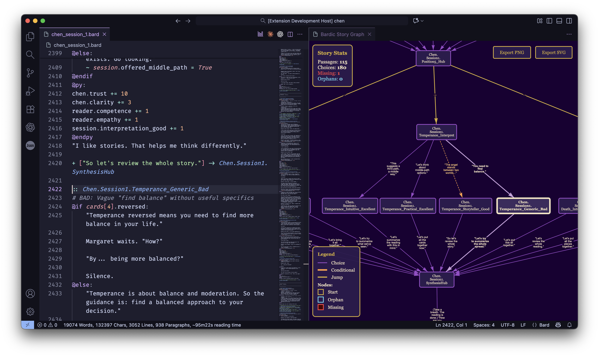

# Bardic Language Support

Syntax highlighting and code snippets for Bardic interactive fiction files (.bard).

Download on the [VS Code Marketplace](https://marketplace.visualstudio.com/items?itemName=katelouie.bardic).

## Features

- **Syntax Highlighting** for all Bardic constructs:
  - Passage headers with tags
  - Variables and expressions
  - Choices (regular and conditional)
  - Control flow (`@if`, `@for`, etc.)
  - Python code blocks with full Python syntax
  - Comments (full-line `#` and inline `//`)
  - Directives (`@include`, `@render`, `@input`, `@state`, `@metadata`)
  - And more!

### Story Graph Visualization ✨ NEW

Visualize your entire story structure as an interactive graph:

**Features:**

- **Color-coded connections**: Regular choices (purple), conditional choices (orange), jumps (gold)
- **Bug detection**: Missing passages highlighted in red, orphaned passages in cyan
- **Click to navigate**: Click any node to jump to that passage in your code
- **Export**: Save your graph as PNG or SVG
- **Stats**: See passage count, choices, and potential issues at a glance
- **Auto-refresh**: Graph updates when you save your file

**To use:** Open any `.bard` file and click the graph icon in the editor toolbar, or run "Bardic: Show Story Graph" from the command palette.

- **Code Snippets** for rapid development:
  - `if` - Simple if block
  - `ifel` - If-else block (no elif)
  - `iff` - Full if/elif/else block
  - `for` - For loop
  - `choice` - Regular choice
  - `cchoice` - Conditional choice
  - `passage` - Passage header
  - `br` - Section divider with dashes
  - `bigbr` - Major section divider with equals signs
  - `metadata` - Metadata block
  - `start` - Start directive

## Usage

Simply open any `.bard` file and enjoy beautiful syntax highlighting!

Type snippet triggers and press Tab to insert code templates with smart tab stops.

## About Bardic

Bardic is a Python-first interactive fiction engine for modern web applications.

- [Bardic on PyPI](https://pypi.org/project/bardic/)
- [Bardic on GitHub](https://github.com/katelouie/bardic)
- [Documentation](https://github.com/katelouie/bardic/blob/main/docs/)

---

**Enjoy writing interactive fiction!** 🦝✨
